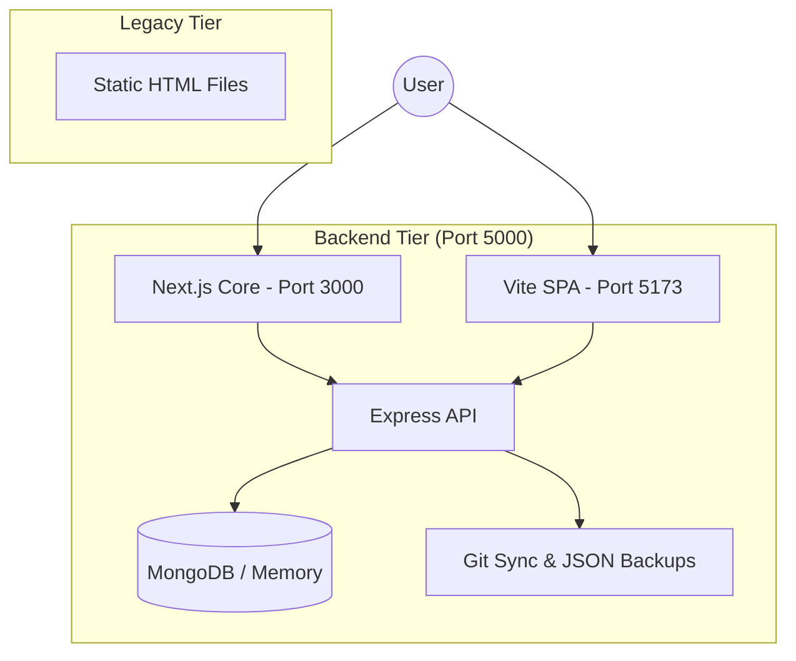

# Sound Thesis — Complete Technical Documentation

> **Institutional-grade wealth management research platform.** A tripartite system featuring a robust Express backend API powering two distinct frontend experiences: a feature-rich Next.js 16 core site and a modern Vite-based Single Page Application (SPA).

---

## Table of Contents

1. [Quick Start](#1-quick-start)
2. [System Architecture](#2-system-architecture)
3. [Directory Structure](#3-directory-structure)
4. [Backend Deep Dive (Express)](#4-backend-deep-dive)
5. [Frontend: Next.js Core (next-app)](#5-frontend-nextjs-core)
6. [Frontend: Vite SPA (app)](#6-frontend-vite-spa)
7. [Database & Storage](#7-database--storage)
8. [VCS & Git Synchronization](#8-vcs--git-synchronization)
9. [Development Workflows](#9-development-workflows)
10. [Troubleshooting](#10-troubleshooting)

---

## 1. Quick Start

### Prerequisites

| Tool | Minimum Version | Purpose |
|------|----------------|---------|
| Node.js | v18+ | JavaScript runtime |
| npm | v9+ | Package management |
| Git | v2.30+ | Version control & sync |

### Launching the Ecosystem

Each component must be started individually (or concurrently using a tool like `concurrently` if configured).

#### 1. Backend API (Required for all frontends)
```bash
cd backend
npm install     # First time only
npm run dev     # Starts Express on http://localhost:5000
```

#### 2. Choice of Frontend

**Option A: Next.js 16 Core (Primary Site + Admin)**
```bash
cd next-app
npm install
npm run dev     # Starts Next.js on http://localhost:3000
```

**Option B: Vite SPA (Modern Dashboard/App)**
```bash
cd app
npm install
npm run dev     # Starts Vite on http://localhost:5173
```

---

## 2. System Architecture



### Technology Stack

| Layer | Technology | Purpose |
|-------|-----------|---------|
| **Core API** | Express.js 5, Node.js | Business logic, JWT auth, File processing |
| **Primary Web** | Next.js 16, React 19, Framer Motion | SSR pages, SEO, Main Admin Panel |
| **New SPA** | Vite, React 19, Tailwind, Shadcn/UI | High-performance client-side dashboard |
| **Data** | MongoDB (Mongoose), MongoMemoryServer | Flexible schema, local-first dev experience |
| **Persistence** | Git, JSON Backup, LocalStorage | Multi-layer data safety and session recovery |

---

## 3. Directory Structure

```
main components ST web/
├── backend/                # Express.js API & Content Management
│   ├── articles/           # Drop folder for PDF/DOCX import
│   ├── data_backup/        # Automatic JSON snapshots of DB records
│   ├── controllers/        # Logical handlers for API routes
│   └── server.js           # Main entry point (Restores DB from JSON)
│
├── next-app/               # Next.js 16 (Primary Website & Admin)
│   ├── app/                # App Router (Articles, Schedule, Admin)
│   ├── public/             # Static assets
│   └── globals.css         # Massive design system (58KB+)
│
├── app/                    # Vite + TypeScript + Tailwind (Modern SPA)
│   ├── src/                # React components & UI logic
│   └── tailwind.config.js  # Styling configuration
│
├── scripts/                # Shared utilities & Legacy JS
├── styles/                 # Legacy CSS wireframes
└── [root].html             # Legacy static Entry points (index, why-us, etc.)
```

---

## 4. Backend Deep Dive

The backend isn't just an API; it's a **self-healing content engine**.

- **Auto-Restoration**: On boot, if the database is empty, it automatically populates from `backend/data_backup/*.json`.
- **Zod Validation**: Strict schema enforcement for every request.
- **Multipart Processing**: Built-in support for image uploads and document (PDF/TXT) parsing.

### Key Logic: Draft vs Published
Content is siloed between `Article` and `Draft` collections. Promoting a draft moves the record, ensuring the public site never sees incomplete work.

---

## 5. Frontend: Next.js Core (next-app)

This is the primary user-facing platform and central Admin Panel.

- **Admin Dashboard**: Located at `/admin`. Includes article management, lead CRM, and VCS controls.
- **VCS Sidebar**: Inside the article editor, allowing users to restore from 30-second heartbeats or manual saves.
- **Session Persistence**: Uses `localStorage` to catch unsaved edits before they even hit the server.

---

## 6. Frontend: Vite SPA (app)

A modern, light-weight alternative built for speed and interactivity.

- **Shadcn/UI**: Uses high-quality accessible primitives for complex UI patterns.
- **Tailwind Ecosystem**: Fully optimized styling with `tailwindcss-animate`.
- **React Router**: Client-side browsing for an app-like feel.

---

## 7. Database & Storage

### Schema Overview

- **Article/Draft**: Title, Slug, Content (HTML), Category, Status, Featured Image.
- **ArticleVersion**: Snapshots of content with `versionType` (autosave/manual).
- **Lead**: Captured consultation data via public forms.

### Backup Strategy
Every change triggers `saveAndSync()`, which:
1. Updates MongoDB.
2. Writes a JSON file to `data_backup/`.
3. Commits and Pushes to Git (Atomic operation).

---

## 8. VCS & Git Synchronization

The project features a **Git-as-a-DB** approach for transparency.

- **Queue System**: Git operations are serialized to prevent `index.lock` collisions.
- **Auto-Recovery**: If a push fails due to remote changes, the backend automatically performs a `git pull --rebase` before retrying.
- **Message Format**: Commits are prefixed (e.g., `VCS [Articles]: ...`) for easy history filtering.

---

## 9. Development Workflows

### Manual Git Sync
If you need to force a synchronization of all local JSON backups to the remote:
1. Visit the **Admin Dashboard**.
2. Click **"Sync to Git"** in the Utility section.

### Importing Content
Bulk import 100+ articles by dropping the JSON formatted file into the Dashboard's Import tool. Categories will be automatically created or mapped.

---

## 10. Troubleshooting

| Symptom | Resolution |
|---------|------------|
| API "Internal Error" | Check `backend/.env` for correct `MONGODB_URI`. |
| CSS styles missing | Ensure `next-app` is running (it hosts the design system). |
| Git Sync stuck | Delete `backend/.git/index.lock` if it exists. |
| Admin Login fails | Ensure `NODE_ENV=development` to trigger default admin seeding. |

---

*Sound Thesis Technical Documentation — Updated Mar 2026*
N files
│       └── versions/           # Individual ArticleVersion JSON files
│
├── next-app/                   # Next.js Frontend
│   ├── app/
│   │   ├── layout.js           # Root layout (fonts, metadata, nav script)
│   │   ├── globals.css         # Complete design system (58KB+)
│   │   ├── page.js             # Homepage
│   │   ├── RouteChangeListener.js  # Client-side nav animations
│   │   │
│   │   ├── admin/              # Admin Panel
│   │   │   ├── layout.js       # Admin shell (sidebar, auth gate, styling)
│   │   │   ├── page.js         # Redirect to /admin/dashboard
│   │   │   ├── login/page.js   # Login form
│   │   │   ├── dashboard/page.js   # Stats cards, Git sync status
│   │   │   ├── articles/
│   │   │   │   ├── page.js     # Article list (status badges, CRUD actions)
│   │   │   │   ├── new/page.js # Create article (autosave, VCS sidebar, localStorage)
│   │   │   │   └── [id]/edit/page.js  # Edit article (autosave, VCS, localStorage)
│   │   │   ├── categories/page.js  # Category management
│   │   │   └── leads/page.js   # Lead CRM (status pipeline, CSV export)
│   │   │
│   │   ├── thesis-notes/       # Public article listing + detail pages
│   │   ├── schedule/page.js    # Consultation booking (localStorage session cache)
│   │   ├── services/page.js    # Services overview
│   │   ├── why-us/page.js      # Company philosophy
│   │   ├── calculators/page.js # Financial calculators
│   │   ├── books/page.js       # Book recommendations
│   │   └── memos/page.js       # Internal memos
│   │
│   └── lib/
│       └── auth.js             # apiFetch utility (token injection, error handling)
│
└── Legacy HTML/                # Original static site files (reference only)
    ├── index.html, services.html, why-us.html, etc.
    ├── styles/wireframe.css    # Original CSS design system
    └── scripts/                # Original JS (nav, faq, widgets)
```

---

## 4. Backend Deep Dive

### Entry Point: `server.js`

The server boots in this exact sequence:

1. **Connect to MongoDB** → `connectDB()` (uses MongoMemoryServer in dev, Atlas URI in prod)
2. **Restore from Backup** → `restoreFromBackup()` reads individual JSON files from `data_backup/` folders and bulk-inserts them if the database is empty
3. **Seed Admin** → `seedAdmin()` creates the default admin user if none exists
4. **Mount Routes** → All API routes are registered
5. **Listen** → Express starts on `PORT` (default 5000)

### Controllers

#### `articles.js` — The Article Engine

| Function | Route | Method | Description |
|----------|-------|--------|-------------|
| `getArticles` | `/api/articles` | GET | Returns published articles (public) or all articles+drafts (admin) |
| `getArticle` | `/api/articles/:id` | GET | Single article by ID or slug |
| `createArticle` | `/api/articles` | POST | Creates article or draft based on status. Generates slug from title. Supports image upload via multer |
| `updateArticle` | `/api/articles/:id` | PUT | Updates article. Creates a `manual_save` ArticleVersion. Handles Draft↔Article promotion/demotion |
| `deleteArticle` | `/api/articles/:id` | DELETE | Removes from both Article and Draft collections |
| `toggleStatus` | `/api/articles/:id/toggle-status` | PUT | Quick Draft↔Published flip from list view |
| `importArticles` | `/api/articles/import` | POST | Bulk JSON import with category auto-mapping |
| `autosaveArticle` | `/api/articles/:id/autosave` | POST | Silent background save + creates `autosave` ArticleVersion |

**Key Logic — Draft/Article Promotion:**
- When status changes to `Published`: record is created in `Article` collection, deleted from `Draft`
- When status changes to `Draft`: record is created in `Draft` collection, deleted from `Article`
- This ensures the public API only ever returns published content

#### `drafts.js` — Draft Autosave

| Function | Route | Method | Description |
|----------|-------|--------|-------------|
| `autosaveDraft` | `/api/drafts/autosave` | POST | Creates or updates a draft. Creates an `autosave` ArticleVersion |
| `getDraft` | `/api/drafts/:id` | GET | Retrieves a single draft by ID |

#### `leads.js` — Lead CRM

| Function | Route | Method | Description |
|----------|-------|--------|-------------|
| `getLeads` | `/api/leads` | GET | All leads, sorted by newest |
| `exportLeads` | `/api/leads/export` | GET | Downloads all leads as CSV file |
| `updateLead` | `/api/leads/:id` | PUT | Updates lead status (Pending → Contacted → Closed) |
| `deleteLead` | `/api/leads/:id` | DELETE | Removes a lead |

#### `versions.js` — VCS History

| Function | Route | Method | Description |
|----------|-------|--------|-------------|
| `getVersions` | `/api/versions/:documentId` | GET | All versions for a document, newest first |
| `getVersion` | `/api/versions/single/:id` | GET | Single version by its own ID |

### Middleware

#### `auth.js` — JWT Protection

```
Request → auth.js middleware → Controller
           │
           ├── Checks Authorization: Bearer <token>
           ├── Verifies JWT with JWT_SECRET
           ├── Attaches req.user = decoded user object
           └── Returns 401 if invalid/expired
```

**Protected routes:** All `/api/articles` (except public GET), `/api/leads`, `/api/categories`, `/api/drafts`, `/api/versions`, `/api/admin/*`

**Unprotected routes:** `GET /api/articles` (public), `POST /api/contact` (public form)

---

## 5. Frontend Deep Dive

### Design System

The entire CSS lives in `globals.css` (58KB+). Key design tokens:

| Token | Value | Usage |
|-------|-------|-------|
| `--color-navy` | `#0F172A` | Primary headings, dark backgrounds |
| `--color-gold` | `#D97706` | CTAs, accents, active states |
| `--color-emerald-light` | `#1B7340` | Success states, published badges |
| `--font-serif` | `Playfair Display` | Headings |
| `--font-sans` | `Inter` | Body text, UI elements |

### Authentication Flow (Frontend)

All admin API calls use `lib/auth.js`:

```javascript
// apiFetch automatically:
// 1. Prepends API_URL (http://localhost:5000/api)
// 2. Injects Authorization: Bearer <token> header
// 3. Sets Content-Type (JSON or FormData)
// 4. Auto-redirects to /admin on 401 (session expired)
// 5. Parses response and returns { ok, data, status }

const result = await apiFetch('/articles', {
    method: 'POST',
    body: JSON.stringify({ title, content, category })
});
```

**Token Storage:**
- Stored in `localStorage` key: `st_token`
- User info in: `st_user`

### Admin Panel Pages

| Page | Path | Features |
|------|------|----------|
| Login | `/admin/login` | Email/password form, JWT token storage |
| Dashboard | `/admin/dashboard` | Stat cards (articles, leads, drafts), Git sync button |
| Articles List | `/admin/articles` | Table with status badges, Edit/View/Delete actions, status toggle |
| New Article | `/admin/articles/new` | Full editor, autosave (30s), localStorage cache, VCS sidebar |
| Edit Article | `/admin/articles/[id]/edit` | Pre-filled editor, autosave, localStorage cache, VCS sidebar, offline fallback |
| Categories | `/admin/categories` | Create/delete categories |
| Leads | `/admin/leads` | Pipeline view (Pending→Contacted→Closed), CSV export |

---

## 6. Database Schemas

### Article

```javascript
{
    title:           String    // Required, trimmed
    slug:            String    // Auto-generated from title (unique)
    content:         String    // Required, supports HTML
    category:        ObjectId  // Ref → Category
    featuredImage:   String    // Filename (default: 'no-photo.jpg')
    author:          String    // Default: 'Sound Thesis Admin'
    status:          String    // 'Draft' | 'Published'
    publicationDate: Date
    createdAt:       Date      // Auto-generated
}
```

### Draft

Identical schema to Article. Stored in a separate collection to keep the public API clean.

### ArticleVersion

```javascript
{
    documentId:    ObjectId  // Reference to original Article or Draft
    documentModel: String   // 'Article' | 'Draft'
    title:         String
    content:       String
    category:      ObjectId
    status:        String   // 'Draft' | 'Published'
    versionType:   String   // 'autosave' | 'manual_save'
    createdAt:     Date     // Indexed DESC for fast history queries
}
```

### Lead

```javascript
{
    name:      String   // Required
    email:     String   // Required, validated regex
    phone:     String   // Optional
    company:   String   // Optional
    message:   String   // Required
    status:    String   // 'Pending' | 'Contacted' | 'Closed'
    createdAt: Date
}
```

### Category

```javascript
{
    name: String  // Required, unique
}
```

### User

```javascript
{
    name:      String
    email:     String   // Unique
    password:  String   // bcrypt hashed (auto via pre-save hook)
    createdAt: Date
}
```

---

## 7. API Reference

### Public Endpoints (No Auth Required)

| Method | Endpoint | Description |
|--------|----------|-------------|
| `GET` | `/api/articles` | List all published articles |
| `GET` | `/api/articles/:slug` | Get single article by slug |
| `GET` | `/api/categories` | List all categories |
| `POST` | `/api/contact` | Submit consultation form (creates Lead) |
| `GET` | `/api/health` | Server health check |

### Admin Endpoints (JWT Required)

| Method | Endpoint | Description |
|--------|----------|-------------|
| `POST` | `/api/admin/auth/login` | Authenticate and receive JWT |
| `GET` | `/api/articles?admin=true` | List all articles + drafts |
| `GET` | `/api/articles/:id?admin=true` | Get single article by ID |
| `POST` | `/api/articles` | Create new article (multipart/form-data) |
| `PUT` | `/api/articles/:id` | Update article |
| `DELETE` | `/api/articles/:id` | Delete article |
| `PUT` | `/api/articles/:id/toggle-status` | Toggle Draft↔Published |
| `POST` | `/api/articles/:id/autosave` | Autosave existing article |
| `POST` | `/api/articles/import` | Bulk import from JSON |
| `POST` | `/api/drafts/autosave` | Create/update draft |
| `GET` | `/api/drafts/:id` | Get single draft |
| `POST` | `/api/categories` | Create category |
| `DELETE` | `/api/categories/:id` | Delete category |
| `GET` | `/api/leads` | List all leads |
| `PUT` | `/api/leads/:id` | Update lead status |
| `DELETE` | `/api/leads/:id` | Delete lead |
| `GET` | `/api/leads/export` | Export leads as CSV |
| `GET` | `/api/versions/:documentId` | Get version history |
| `GET` | `/api/versions/single/:id` | Get single version |
| `POST` | `/api/admin/utility/sync` | Trigger manual Git sync |
| `GET` | `/api/admin/utility/sync-status` | Get Git sync status |

---

## 8. Authentication System

### How It Works

```
Login Form ──POST──▶ /api/admin/auth/login
                           │
                     ┌─────▼──────┐
                     │ Find user   │
                     │ by email    │
                     └─────┬──────┘
                           │
                     ┌─────▼──────┐
                     │ bcrypt     │
                     │ compare   │
                     └─────┬──────┘
                           │
                     ┌─────▼──────┐
                     │ Sign JWT   │
                     │ (30d exp)  │
                     └─────┬──────┘
                           │
                     ◀─────┘ { token, user }
                           │
              localStorage.setItem('st_token', token)
```

### Token Lifecycle

- **Generated:** On successful login via `bcryptjs.compare()`
- **Stored:** `localStorage` keys `st_token` and `st_user`
- **Injected:** Automatically by `apiFetch()` in every admin request
- **Validated:** `auth.js` middleware decodes via `jwt.verify()`
- **Expired:** After 30 days → `apiFetch()` catches 401 → auto-logout → redirect to `/admin`

---

## 9. Version Control System (VCS)

The VCS creates a complete historical record of every article change, stored in the `ArticleVersion` collection.

### When Versions Are Created

| Trigger | Version Type | Location |
|---------|-------------|----------|
| Autosave timer (every 30s) on New Article page | `autosave` | `drafts.js` controller |
| Autosave timer (every 30s) on Edit Article page | `autosave` | `articles.js` controller |
| Admin clicks "Update Article" | `manual_save` | `articles.js` controller |

### Version History UI

The admin article editor includes a collapsible **Version History Sidebar**:

- Toggle via **"View History"** button (top right of editor)
- Versions listed newest-first with badges:
  - 🔵 **Auto Run** — created by the 30-second autosave timer
  - 🟢 **Manual** — created when the admin explicitly saved
- Each version shows: timestamp, title, and a **"Restore"** button
- Clicking Restore populates the form with that version's data (you still must click Save to persist)

### Data Flow

```
User Types in Editor
        │
        ▼ (every 30 seconds)
handleAutosave() ──POST──▶ /api/drafts/autosave  (or /api/articles/:id/autosave)
                                  │
                           ┌──────▼──────┐
                           │ Save/Update  │
                           │ Draft/Article│
                           └──────┬──────┘
                                  │
                           ┌──────▼──────┐
                           │ Create       │
                           │ ArticleVersion│
                           │ (autosave)   │
                           └──────┬──────┘
                                  │
                           ┌──────▼──────┐
                           │ saveAndSync  │──▶ backupDatabase() ──▶ gitCommit+Push
                           └─────────────┘
```

---

## 10. Local Backup & Restoration

### Granular File Architecture

Every database record is saved as an **individual JSON file** named by its MongoDB `_id`:

```
backend/data_backup/
├── articles/
│   ├── 64f1a2b3c4d5e6f7g8h9i0j1.json    ← One article
│   └── 64f1a2b3c4d5e6f7g8h9i0j2.json    ← Another article
├── drafts/
│   └── 69b02a4b8f0c6a5caaf20247.json
├── leads/
│   └── 69b02a04380cdb8802af31a1.json
├── categories/
│   └── 64f1a2b3c4d5e6f7g8h9i0k3.json
└── versions/
    ├── 69b02a60abc123def4567890.json     ← Autosave snapshot
    └── 69b02a61abc123def4567891.json     ← Manual save snapshot
```

### When Backups Fire

`backupDatabase()` is called by `saveAndSync()` which triggers on:

- Article create / update / delete
- Draft autosave
- Lead submission (public contact form)
- Lead status update / deletion
- Category create / delete
- Manual Git sync from admin dashboard

### Automatic Restoration on Server Boot

When the backend starts with an empty database (e.g., after MongoMemoryServer restarts in dev):

```
server.js → restoreFromBackup()
    │
    ├── Scans data_backup/articles/*.json → insertMany into Article collection
    ├── Scans data_backup/categories/*.json → insertMany into Category collection
    ├── Scans data_backup/leads/*.json → insertMany into Lead collection
    ├── Scans data_backup/drafts/*.json → insertMany into Draft collection
    └── Scans data_backup/versions/*.json → insertMany into ArticleVersion collection
```

**Safety:** Restoration only runs if `Model.countDocuments() === 0` (empty collection), preventing duplicate data.

---

## 11. Session Persistence (localStorage)

All forms cache their data to the browser's `localStorage` so user input survives tab closures, browser restarts, and navigation.

### localStorage Keys Reference

| Key | Page | Contains | Cleared When |
|-----|------|----------|-------------|
| `soundthesis_new_article_draft` | `/admin/articles/new` | `{ title, category, content, status, publicationDate }` | Article successfully created |
| `soundthesis_edit_article_{id}` | `/admin/articles/[id]/edit` | `{ title, category, content, status, publicationDate }` | (Persists for offline fallback) |
| `current_article_draft_id` | `/admin/articles/new` | MongoDB ObjectId string of the current draft | Article successfully created |
| `soundthesis_lead_draft` | `/schedule` | `{ name, email, phone, countryCode, company, message, date1-3, time1-3 }` | Lead successfully submitted |
| `st_token` | `/admin/*` | JWT authentication token | Logout or 401 |
| `st_user` | `/admin/*` | `{ name, email }` | Logout |

### How It Works

```javascript
// WRITE: Debounced (1 second) to avoid excessive writes
useEffect(() => {
    const timer = setTimeout(() => {
        localStorage.setItem('key', JSON.stringify(formData));
    }, 1000);
    return () => clearTimeout(timer);
}, [formData]);

// READ: On component mount
useEffect(() => {
    const saved = localStorage.getItem('key');
    if (saved) setFormData(JSON.parse(saved));
}, []);
```

### Offline Fallback (Edit Page Only)

If the backend is unreachable when loading the edit page, the system falls back to localStorage data with a warning message: *"Restored from local cache (backend offline)"*.

---

## 12. Git Synchronization

### How `gitSync.js` Works

```
saveAndSync("VCS [Articles]: Admin created article 'Example'")
     │
     ├──▶ backupDatabase()     ← writes individual JSON files
     │
     └──▶ syncToGit(message)   ← queued Git operations
              │
         ┌────▼────┐
         │ git add .│
         │ git commit -m "..."│
         │ git push │
         └────┬────┘
              │
         Error Handling:
         ├── index.lock? → Retry up to 5 times (2s delay)
         ├── nothing to commit? → Resolve silently
         ├── push rejected? → git pull --rebase && git push (rescue)
         └── other error? → Log and continue
```

### Queue System

Git operations are serialized through a queue to prevent race conditions. If multiple admin actions fire simultaneously, each waits for the previous sync to complete before executing.

### VCS Commit Message Format

```
VCS [Articles]: Admin created article "Title"
VCS [Articles]: Admin updated article "Title"
VCS [Articles]: Admin deleted article "Title"
VCS [Leads]: New public lead submission from email@example.com
VCS [Leads]: Admin updated status for lead email@example.com to Contacted
VCS [Leads]: Admin deleted lead email@example.com
VCS [Categories]: Admin created category "Technology"
```

---

## 13. Admin Panel Workflows

### Creating an Article

1. Navigate to `/admin/articles/new`
2. Enter title, select category (or create one inline), write content
3. Form autosaves to `localStorage` every 1 second
4. Backend autosave fires every 30 seconds (creates Draft + ArticleVersion)
5. Click **"Create Article"** → article published, localStorage cleared, redirected to list

### Editing an Article

1. Click **"Edit"** on any article in the list
2. Form loads from backend (or localStorage if backend is down)
3. Autosave fires every 30 seconds
4. Click **"View History"** to see all past versions
5. Click **"Restore"** on any version to revert, then **"Update Article"** to save

### Managing Leads

1. Navigate to `/admin/leads`
2. View all consultation requests in a table
3. Change status via dropdown: `Pending → Contacted → Closed`
4. Click **"Export CSV"** to download all leads as a spreadsheet

### Importing Articles (Bulk)

Expected JSON format:
```json
[
    {
        "title": "Article Title",
        "content": "<p>HTML content here</p>",
        "category": "Category Name",
        "status": "Published"
    }
]
```

Upload via the Dashboard import feature. Categories are auto-matched by name.

---

## 14. Environment Variables

### Backend (`backend/.env`)

| Variable | Default | Description |
|----------|---------|-------------|
| `PORT` | `5000` | Express server port |
| `NODE_ENV` | `development` | `development` uses MongoMemoryServer, `production` uses Atlas |
| `MONGODB_URI` | `mongodb://localhost:27017/sound-thesis` | MongoDB connection string |
| `JWT_SECRET` | `your_super_secret_jwt_key_here` | Secret for signing JWT tokens |

### Frontend (`next-app/.env.local`)

| Variable | Default | Description |
|----------|---------|-------------|
| `NEXT_PUBLIC_API_URL` | `http://localhost:5000/api` | Backend API base URL |

---

## 15. Deployment

### Docker (Recommended for Production)

```bash
docker-compose up --build
```

This starts:
- **frontend** container on port 3000
- **backend** container on port 5000
- **mongodb** container with persistent volume

### Manual Production

```bash
# Backend
cd backend
NODE_ENV=production MONGODB_URI=mongodb+srv://... npm start

# Frontend
cd next-app
NEXT_PUBLIC_API_URL=https://api.soundthesis.com/api npm run build && npm start
```

---

## 16. Troubleshooting

| Problem | Root Cause | Solution |
|---------|-----------|----------|
| "Failed to fetch" on admin pages | Backend not running or crashed | Check if `npm run dev` is running in `backend/`. Restart if needed |
| Database returns empty after restart | MongoMemoryServer resets in dev | This is normal — `restoreFromBackup()` auto-restores from `data_backup/` |
| "ERR_CONNECTION_REFUSED" on port 5000 | Port conflict or server crash | Kill node processes: `Stop-Process -Name "node" -Force` then restart |
| MongoMemoryServer SyntaxError on boot | Corrupted database cache | Delete `%TEMP%\st-db-stable` folder, then restart backend |
| Git push fails with "index.lock" | Concurrent Git operations | `gitSync.js` handles this with 5 automatic retries |
| Git push rejected | Remote has newer changes | `gitSync.js` auto-runs `git pull --rebase && git push` |
| Article data lost on refresh | localStorage not saving | Check browser DevTools → Application → Local Storage for `soundthesis_new_article_draft` |
| Lead form data not persisting | localStorage key wrong | Check for `soundthesis_lead_draft` in browser DevTools |

### Force Reset Everything

```powershell
# Kill all processes
Stop-Process -Name "node" -Force -ErrorAction SilentlyContinue
Stop-Process -Name "mongod" -Force -ErrorAction SilentlyContinue

# Clear corrupted MongoDB cache
Remove-Item -Recurse -Force -Path $env:TEMP\st-db-stable -ErrorAction SilentlyContinue

# Restart
cd backend && npm run dev
cd next-app && npm run dev
```

---

---

## 17. File-Based Article Publishing

You can now publish articles without using the admin panel. Simply drop supported files into the `backend/articles/` directory.

### Supported Formats
- **.txt**: Plain text (first line = title)
- **.html**: HTML files (extracts `<title>` or `<h1>`)
- **.pdf**: PDF documents
- **.docx**: Word documents

### Folder-as-Category
The system uses subdirectories for categorization:
```
backend/articles/
├── Behavioral Finance/    ← Category button: "Behavioral Finance"
│   └── temperament-tax.html
├── Asset Allocation/      ← Category button: "Asset Allocation"
│   └── compound-interest.html
└── article.txt            ← Category: "Uncategorized"
```

### Live Synchronization
- **Instant Reflect**: The backend performs a live scan on every request. No server restart or manual sync is needed.
- **Git Integration**: When you move or add files, they are committed to the repository just like database updates.

---

*Documentation Version: 5.0 (File-Based Article System)*
*Last Updated: March 2026*

